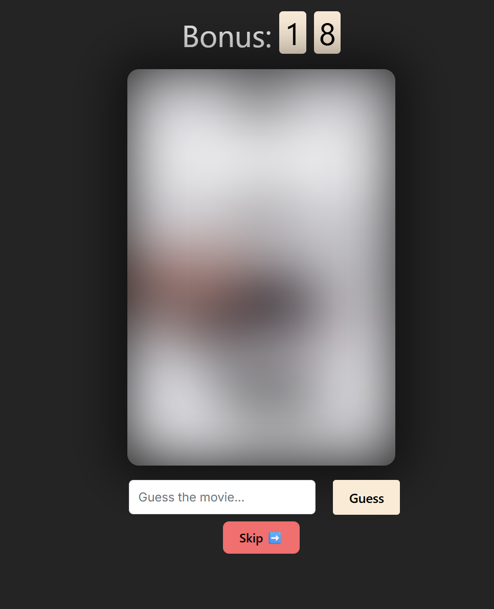

# 🎬 What The Film

**What The Film** is a web-based game where players guess the title of a movie based on its poster. The poster starts heavily blurred or pixelated, and with every incorrect attempt, its clarity improves. The earlier a player guesses correctly, the higher their score.

## 

---

## 🛠 Tech Stack

### Frontend

- **React** (TypeScript)
- **Vite** – fast bundler for development
- **Framer Motion** – smooth transitions and animations
- **CSS Modules** – for scoped styling

### Backend

- **Django**
- **Django REST Framework (DRF)** – provides a RESTful API
- **SQLite / PostgreSQL** – database for storing users, scores, and movie data

### Integration

- API endpoints are served from Django (`/api/...`) and consumed by the React frontend.
- CSRF protection enabled for secure communication.

---

## ⚙️ Architecture

WhatTheFilm/
│
├── backend/ (Django project)
│ ├── wtf/ (main Django app)
│ ├── api/ (REST API endpoints)
│ ├── users/ (user registration, authentication, and score storage)
│ ├── db.sqlite3 (or PostgreSQL database)
│ └── manage.py
│
├── frontend/ (React app)
│ ├── src/
│ │ ├── components/ (PosterImage, GuessInput, Counter, etc.)
│ │ ├── App.tsx
│ │ ├── api.ts (API communication layer)
│ │ └── styles/
│ ├── public/index.html
│ └── vite.config.ts
│
├── README.md
└── .env (environment variables)

- **Frontend** fetches movie posters and submits user guesses via API calls to the backend.
- **Backend** serves poster metadata, validates guesses, and manages user accounts and scores.

---

## 🚀 Features

✅ Guess movie titles based on progressively clearer posters  
✅ User authentication (register, log in, and track your scores)  
✅ Auto-suggestions for movie titles while typing  
✅ Countdown timer for added challenge  
✅ Responsive design – works on desktop and mobile

---

## 🖥 Live Demo

🚧 _Coming soon…_

---

## 🛠 Setup Instructions

1. **Clone the repository**

   ```bash
   git clone https://github.com/yourusername/what-the-film.git
   cd what-the-film
   ```

2. **Backend setup**
   ```bash
   cd backend
   python -m venv venv
   source venv/bin/activate # On Windows: venv\Scripts\activate
   pip install -r requirements.txt
   python manage.py migrate
   python manage.py runserver
   ```
3. **Frontend setup**

```bash
  cd frontend
  npm install
  npm run dev
```

4. **Open the app in your browser at http://localhost:5173**
